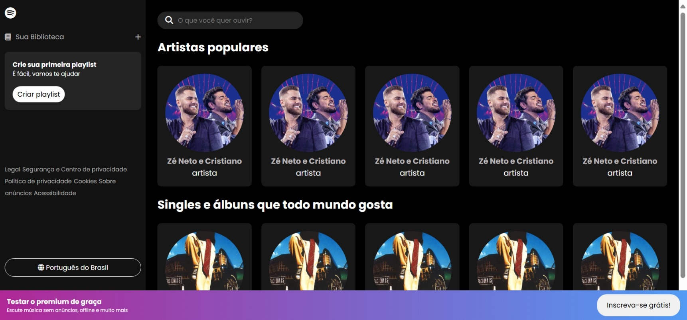

# 🎵 Spotify Clone

Um clone minimalista da interface do Spotify feito apenas com **HTML, CSS e JavaScript puro**, perfeito para iniciantes aprenderem conceitos essenciais de frontend.

## 🖼️ Preview
<div align="center">
  
  <p>Exemplo da interface do clone</p>
</div>

## ✨ Funcionalidades
- **Sidebar** de navegação estilo Spotify  
- **Lista de artistas** simulada  
- **Lista de álbums** simulada 
- Design **responsivo** (se adapta a telas diferentes)  

## 🛠️ Tecnologias
- **HTML5** (estrutura semântica)  
- **CSS3** (Flexbox, Grid e animações básicas)  
- **JavaScript Vanilla** (DOM manipulation)  

## 🚀 Como Usar
1. Clone o repositório:  
   ```bash  
   git clone https://github.com/vieiraeduardos/spotify-clone.git

1. Abra o arquivo index.html no navegador. 
